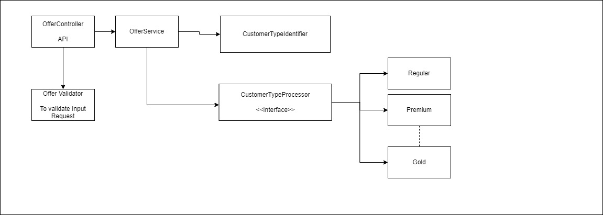

# Architecture



This repository contains an architecture diagram that illustrates the structure and components of the system.

## Overview

The architecture is designed to explain API call flow and its extensibility.


## Installation
```bash
$ mvn install
```
## Usage

### API Call Example

You can interact with the architecture via its API. Here's an example of making a simple API call using Postman:

1. Open Postman.
2. Set the request type to **GET**.
3. Enter the API endpoint URL: `http://localhost:8080/offer/premium/calculate?purchaseAmount=1000`
4. Click the Send button.

***API Response***

***Success Response:***
```json
900, OK
```
***Error Response:***
```json
invalid customerType, BAD REQUEST
